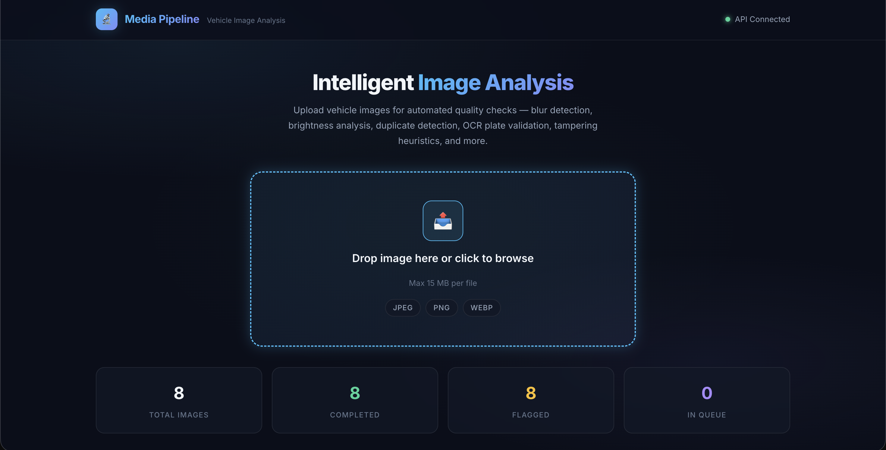
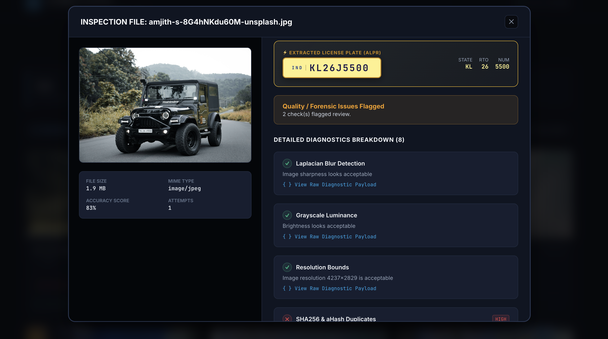
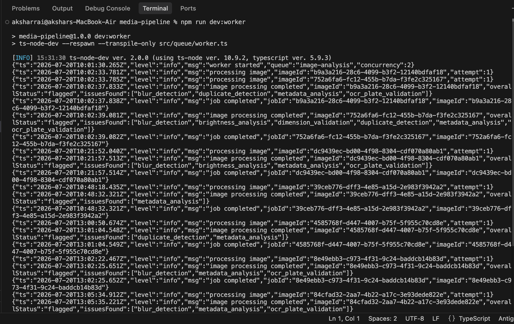

# Intelligent Media Processing Pipeline & Quality Inspection System

An end-to-end, asynchronous media processing system and interactive visual dashboard for vehicle image verification and automatic license plate recognition (ALPR). Built with Express, TypeScript, BullMQ, Redis, PostgreSQL, Prisma, Sharp, Tesseract.js, and a Vite Frontend.

Designed to handle high-concurrency vehicle image uploads, queuing them for distributed computer vision analysis to automatically extract and validate vehicle registration plates, detect quality issues (blur, lighting anomalies), identify duplicate submissions, inspect photo tampering, and verify metadata integrity in real time.

---

## Project Outcomes & System Screenshots

Place your system screenshots in this section to demonstrate the working dashboard, upload workflow, and detailed analysis results.

### Dashboard Overview & Upload Interface

*Figure 1: Main Dashboard showing real-time system stats, active filter controls, drag-and-drop upload zone, and recent submission cards.*

---

### Detailed Quality Check Inspection Modal

*Figure 2: Comprehensive inspection view rendering individual check results, confidence scores, issue flags, license plate extractions, and expandable diagnostic metadata.*

---

### Terminal Execution & Worker Logs

*Figure 3: Multi-process terminal output illustrating concurrent BullMQ job processing, database persistence, and Express API responses.*

---

## Flagship Capability: Automatic Vehicle License Plate Recognition (ALPR)

Vehicle registration plate detection and validation is a core automated feature of this pipeline:

- **Automated Text Extraction**: Powered by an embedded `tesseract.js` WASM engine running asynchronously in background workers without blocking the main API thread.
- **Robust Text Normalization**: Noise filtering and uppercase normalization to handle variable photo lighting, character spacing, and OCR font ambiguities.
- **Standardized Format Validation**: Regex pattern matching against official Indian vehicle registration structures (`SS DD L(L) DDDD`, e.g., `KA05MH1234`):
  - **State Code (`SS`)**: 2-letter state identifier (e.g., `KA`, `MH`, `DL`).
  - **RTO Code (`DD`)**: 2-digit Regional Transport Office code.
  - **Series Code (`L(L)`)**: 1 or 2 letter registration series.
  - **Unique Registration Number (`DDDD`)**: 4-digit vehicle identifier.
- **Structured Output**: Extracted plate data is parsed into distinct component fields (`stateCode`, `rtoCode`, `seriesCode`, `uniqueNumber`) and returned in structured JSON for downstream verification workflows.

---

## Key Features & System Capabilities

- **Fast Non-Blocking Submissions**: API accepts multipart uploads instantly (`202 Accepted`), computes fast hashes, and delegates heavy CV analysis to background workers via BullMQ queues.
- **8 Automated Computer Vision & Forensic Checks**:
  1. **OCR Plate Extraction & Validation (Core Feature)**: Full-frame OCR text extraction using `tesseract.js` paired with Indian vehicle registration plate regex parsing (`SS DD L(L) DDDD`).
  2. **Blur Detection**: Laplacian variance computation over pixel intensity gradients.
  3. **Brightness Analysis**: Mean grayscale luminance evaluation (under/over-exposure).
  4. **Dimension Validation**: Resolution checks against configurable operational standards.
  5. **Duplicate Detection**: Dual-layer detection using exact SHA-256 hashing and near-duplicate Average Hashing (`aHash`) with Hamming distance comparison.
  6. **Screenshot & Re-photo Detection**: Identifies screen captures via known resolution profiles, missing EXIF metadata, and `Software` EXIF tags.
  7. **Metadata Integrity Analysis**: Detects stripped EXIF headers on JPEG uploads.
  8. **Tampering & Editing Heuristic**: Error Level Analysis (ELA) measuring peak-to-mean re-compression variance to spot localized photo modifications.
- **Interactive Single-Page Visual Dashboard**:
  - Drag-and-drop file upload zone supporting JPEG, PNG, and WebP formats.
  - Live processing stats, real-time status polling (`pending`, `processing`, `completed`, `failed`).
  - Overall status indicators (`Clean` vs `Flagged`) and transparent weighted confidence scores.
  - Detailed Modal inspect view detailing individual pass/fail checks, extracted license plate details, severity levels (`high`, `medium`, `low`), and inspectable raw check metadata.
- **Resilience & Fault Tolerance**: Isolated check execution (one failing heuristic never aborts the rest of the pipeline), BullMQ job retries with exponential backoff, and strict request validation.

---

## System Architecture

```
                       ┌────────────────────────────────────────┐
                       │           Client / Frontend            │
                       │   Vite + Vanilla JS Single-Page App    │
                       └───────────────────┬────────────────────┘
                                           │
                                  POST /images (multipart)
                                           │
                                           ▼
┌─────────────────────────────────────────────────────────────────────────────────┐
│                                   Express API                                   │
│                                                                                 │
│  1. Saves file to disk (`./uploads`)                                             │
│  2. Synchronously computes SHA-256 + aHash                                     │
│  3. Creates `Image` row in Postgres (status: pending)                           │
│  4. Enqueues job in BullMQ (jobId = image UUID)                                 │
│  5. Returns 202 Accepted { id, status: "pending" } immediately                  │
└──────────────────────────────────────────┬──────────────────────────────────────┘
                                           │
                                           ▼
                               ┌───────────────────────┐
                               │     Redis Queue       │
                               │      (BullMQ)         │
                               └───────────┬───────────┘
                                           │
                                           ▼
┌─────────────────────────────────────────────────────────────────────────────────┐
│                            Worker Process (Async)                               │
│                                                                                 │
│  • Concurrency: 2 (configurable)                                                │
│  • Status -> processing                                                         │
│  • Runs all 8 Analysis Checks independently (including OCR Plate Detection)     │
│  • Computes overallStatus (clean/flagged) & weighted confidenceScore           │
│  • Writes analysisResult JSON blob to Postgres                                  │
│  • Status -> completed (or failed after max retries)                            │
└────────────────────────────────└────────────────────────────────────────────────┘
```

---

## Tech Stack & Technical Rationale

| Layer | Technology | Rationale |
|---|---|---|
| **API Backend** | Node.js, Express, TypeScript | High I/O performance, strong typing, low runtime overhead. |
| **Async Queue** | BullMQ, Redis | Robust job scheduling, built-in concurrency control, retries with exponential backoff, and job idempotency. |
| **Database** | PostgreSQL, Prisma ORM | Relational schema fits the image processing lifecycle; Prisma provides type-safe queries and automated schema migrations. |
| **OCR Engine** | `tesseract.js` | Pure JavaScript/WASM Tesseract implementation ensuring zero external C++ binary system setup for license plate extraction. |
| **Image Forensic Processing** | `sharp` | High-performance C++ `libvips` bindings for fast pixel manipulation, grayscale conversion, diffing, and convolutions without native OpenCV dependencies. |
| **Frontend UI** | Vite, Vanilla JavaScript, CSS3 | Zero-framework footprint, ultra-fast UI rendering, glassmorphic dark design system with micro-animations. |
| **Storage** | Local Disk (`./uploads`) | Decoupled storage adapter interface allowing easy future transition to S3/Cloud Storage. |

---

## Repository Structure

```
.
├── docker-compose.yml        # Multi-container orchestration (Postgres, Redis, API, Worker)
├── Dockerfile                # Production multi-stage Docker build
├── package.json              # Backend dependencies & npm scripts
├── prisma/
│   └── schema.prisma         # Postgres database schema definition
├── scripts/
│   └── seed.ts               # Synthetic sample generator & seeding script
├── src/
│   ├── app.ts                # Express application setup & static file serving
│   ├── server.ts             # API HTTP server entry point
│   ├── config.ts             # Environment variable validation & defaults
│   ├── db.ts                 # Prisma client instance
│   ├── controllers/          # Request handlers (upload, status, results, list)
│   ├── routes/               # API endpoint definitions
│   ├── services/             # Database & queue interaction logic
│   ├── queue/                # BullMQ queue setup & worker event handlers
│   ├── utils/                # Hashing (SHA256, aHash), logger, and upload helpers
│   └── analysis/             # Computer vision & forensic heuristics
│       ├── blur.ts           # Laplacian variance calculation
│       ├── brightness.ts     # Mean pixel intensity calculation
│       ├── dimensions.ts     # Resolution bounds checking
│       ├── duplicate.ts      # Exact & Hamming-distance near-duplicate search
│       ├── screenshot.ts     # Resolution profile & EXIF check
│       ├── metadata.ts       # EXIF headers presence validation
│       ├── tampering.ts      # Error Level Analysis (ELA) peak/mean ratio
│       └── ocrPlate.ts       # Full-frame OCR & Indian plate regex validation (ALPR)
├── frontend/                 # Web Dashboard
│   ├── index.html            # App HTML shell
│   ├── vite.config.js        # Vite build configuration
│   ├── package.json          # Frontend dependencies
│   └── src/
│       ├── api.js            # API client module for backend communication
│       ├── style.css         # Custom CSS tokens & glassmorphic layout
│       └── main.js           # Single-page application logic & UI updates
└── tests/
    └── analysis.test.ts      # Unit tests for core CV algorithms
```

---

## Setup & Execution Guide

### Prerequisites
- Node.js (v18 or higher)
- Docker & Docker Compose *(Optional, for containerized run)*
- PostgreSQL & Redis *(If running manually without Docker)*

---

### Option A: Docker Compose (Recommended)

1. Clone the repository:
   ```bash
   git clone https://github.com/Raiakshar/Intelligent-Media-Processing-Pipeline.git
   cd Intelligent-Media-Processing-Pipeline
   ```

2. Copy the environment configuration:
   ```bash
   cp .env.example .env
   ```

3. Spin up all services (Postgres, Redis, Backend API, Worker):
   ```bash
   docker compose up --build
   ```
   - **Backend API**: `http://localhost:3000`
   - Database migrations will automatically run prior to API startup.

4. *(Optional)* Start the Frontend Web Dashboard:
   ```bash
   cd frontend
   npm install
   npm run dev
   ```
   - Access UI at `http://localhost:5173` or `http://localhost:5174`.

---

### Option B: Local Manual Setup

#### 1. Backend Setup
```bash
# 1. Install dependencies
npm install

# 2. Configure environment
cp .env.example .env

# 3. Apply database migrations
npx prisma migrate dev --name init

# 4. Terminal 1: Launch Backend API Server
npm run dev

# 5. Terminal 2: Launch Background Worker
npm run dev:worker
```

#### 2. Frontend Dashboard Setup
```bash
# Terminal 3: Launch Visual Dashboard
cd frontend
npm install
npm run dev
```
Open `http://localhost:5173` in your browser.

---

### Seeding Sample Data & Testing

#### Seed Synthetic Images
Run the seeding script to automatically upload sample test images (valid size vs undersized) to verify queueing and worker execution:
```bash
npm run seed
```

#### Run Unit Tests
Run standalone unit tests for computer vision algorithms (blur, brightness, hashing, dimensions):
```bash
npm test
```

---

## API Reference Documentation

### 1. Upload Image
`POST /images`
- **Content-Type**: `multipart/form-data`
- **Form Field**: `image` (File: `.jpg`, `.jpeg`, `.png`, `.webp` up to 15MB)
- **Response** (`202 Accepted`):
```json
{
  "id": "b3f1c2a0-1234-4abc-9def-abcdef123456",
  "status": "pending",
  "uploadedAt": "2026-07-20T10:00:00.000Z",
  "message": "Image accepted and queued for processing."
}
```

### 2. Get Processing Status
`GET /images/:id/status`
- **Response** (`200 OK`):
```json
{
  "id": "b3f1c2a0-1234-4abc-9def-abcdef123456",
  "status": "completed",
  "attempts": 1,
  "uploadedAt": "2026-07-20T10:00:00.000Z",
  "processingStartedAt": "2026-07-20T10:00:01.500Z",
  "processedAt": "2026-07-20T10:00:04.200Z"
}
```

### 3. Get Analysis Results
`GET /images/:id/results`
- Returns `409 Conflict` if processing is not yet `completed`.
- **Response** (`200 OK`):
```json
{
  "id": "b3f1c2a0-1234-4abc-9def-abcdef123456",
  "status": "completed",
  "processedAt": "2026-07-20T10:00:04.200Z",
  "analysis": {
    "overallStatus": "clean",
    "issuesFound": [],
    "confidenceScore": 1.0,
    "checks": [
      {
        "check": "ocr_plate_validation",
        "passed": true,
        "severity": "none",
        "details": {
          "extractedPlate": "KA05MH1234",
          "stateCode": "KA",
          "rtoCode": "05",
          "seriesCode": "MH",
          "uniqueNumber": "1234",
          "rawMatch": "KA 05 MH 1234"
        },
        "message": "Valid-format plate detected: KA05MH1234"
      },
      {
        "check": "blur_detection",
        "passed": true,
        "severity": "none",
        "details": { "laplacianVariance": 240.5, "threshold": 100 },
        "message": "Image sharpness is sufficient (Laplacian variance 240.5 >= threshold 100)"
      }
    ]
  }
}
```

### 4. Get Failure Details
`GET /images/:id/failure`
- Returns `409 Conflict` unless `status === "failed"`.
- **Response** (`200 OK`):
```json
{
  "id": "b3f1c2a0-1234-4abc-9def-abcdef123456",
  "status": "failed",
  "attempts": 3,
  "failureReason": "Stored file missing on disk: ./uploads/b3f1c2a0..."
}
```

### 5. List Images (Paginated)
`GET /images?status=completed&limit=20&offset=0`
- **Response** (`200 OK`):
```json
{
  "items": [ /* list of image summary records */ ],
  "total": 42,
  "limit": 20,
  "offset": 0
}
```

### 6. Health Check
`GET /health`
- **Response** (`200 OK`):
```json
{
  "status": "ok",
  "ts": "2026-07-20T10:02:24.816Z"
}
```

---

## Analysis Heuristics Specification

| Check Name | Inspection Technique | Failure Threshold / Logic | Severity |
|---|---|---|---|
| `ocr_plate_validation` | Full-frame OCR text extraction using Tesseract.js WASM engine, normalized and evaluated against Indian vehicle plate regex (`SS DD L(L) DDDD`). | No matching plate string found | Medium |
| `blur_detection` | Convolves a 3x3 Laplacian operator over grayscale pixels using Sharp. | Laplacian Variance < 100 | High |
| `brightness_analysis` | Computes mean pixel intensity across the luminance channel. | Mean < 60 (Low Light) or Mean > 200 (Overexposed) | Medium |
| `dimension_validation` | Reads image dimensions via metadata headers. | Width < 400px or Height < 300px | High |
| `duplicate_detection` | SHA-256 for exact match; 64-bit Average Hash (`aHash`) with Hamming Distance. | Hamming Distance ≤ 5 against recent 500 images | High |
| `screenshot_rephoto_heuristic` | Cross-references aspect ratio & resolution against common mobile screen sizes, checks `Software` EXIF tags and missing camera EXIF data. | Known screen resolution match OR screenshot EXIF metadata tags | High |
| `metadata_analysis` | Parses EXIF structure on JPEG files using `exifr`. | Total absence of EXIF data on JPEG format | Low |
| `tampering_heuristic` | Error Level Analysis (ELA): Re-compresses JPEG at 95% quality, computes pixel difference, and calculates ratio of peak variance to mean variance. | Peak-to-mean error ratio > threshold | Medium |

---

## AI Usage Disclosure

In compliance with assignment evaluation requirements, this project was co-engineered using Anthropic Claude & Google DeepMind AI coding assistants as pair programmers across the full development cycle:

- **Architecture & Scaffolding**: Generated initial Express/TypeScript routes, Prisma schema, and BullMQ producer/worker wiring.
- **Computer Vision & OCR Implementation**: Designed and tuned CV algorithms using Sharp (Laplacian convolution mask for blur detection, average perceptual hashing (`aHash`) for near-duplicate matching, and peak-to-mean ELA ratios for localized tampering detection) and Tesseract.js regex normalization for license plate extraction.
- **Frontend Dashboard**: Scaffolded the responsive Single-Page Dashboard in Vite with dark glassmorphic styling, real-time polling, and interactive check detail views.
- **Corrections & Engineering Decisions**:
  - *Tampering Heuristic*: Adjusted initial ELA implementation from pure mean error diff (which misclassified high-quality JPEGs as tampered) to peak-to-mean variance ratio to isolate localized edits.
  - *Duplicate Detection Scalability*: Bounded near-duplicate comparison against a rolling window of 500 recent uploads to prevent O(N) database bottlenecks.
  - *Fault Isolation*: Wrapped each analysis check in independent `try...catch` blocks to ensure a single check failure does not crash remaining heuristics or abort the worker.

---

## Trade-offs & Future Extensions

- **Local Storage vs Cloud Storage**: Uses local disk (`./uploads`) for simplicity within assignment scope. In production, this can be swapped with an S3/Cloud Storage provider interface.
- **OCR Localization**: Currently runs OCR over the full frame without prior license plate region cropping. A dedicated YOLO/SSD object detection model for plate bounding box cropping would significantly boost OCR accuracy on distant vehicles.
- **Duplicate Indexing**: Near-duplicate `aHash` comparison scans a bounded window (500 records). Production scale would leverage Vector ANN indexing (e.g., Milvus, pgvector) or Vantage Point Trees (VP-Trees).

---

## License

MIT License. Developed for the Intelligent Media Processing Pipeline assignment.
