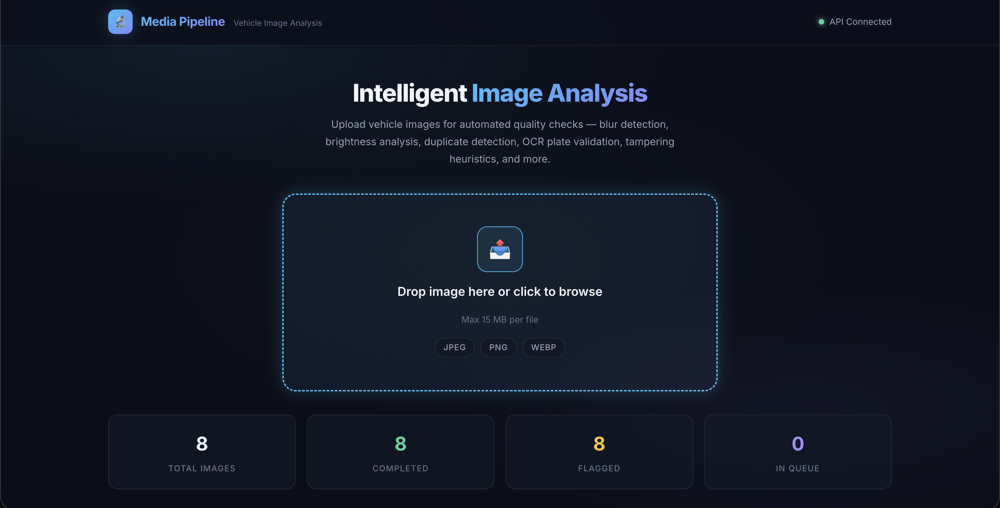
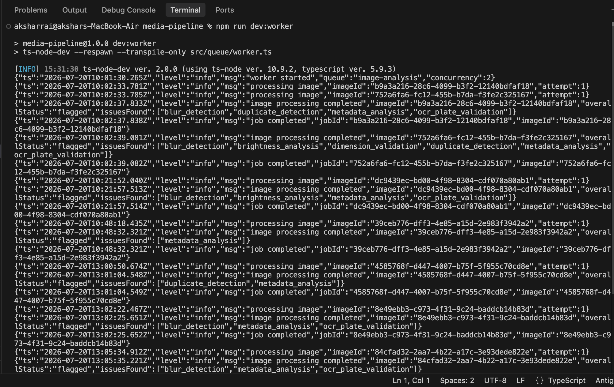

# Intelligent Media Processing Pipeline

This is a vehicle photo inspection system I built from scratch. You upload a car image and it automatically does a bunch of checks in the background — reads the license plate using OCR, checks if the photo is blurry or too dark, catches duplicate submissions, and tries to detect if the image has been tampered with. Everything runs async so the upload response is instant and the heavy work happens in the background.

Live demo: https://intelligent-media-processing-pipeline-q20l.onrender.com/

---

## What it looks like

### Dashboard


*Main dashboard — shows stats up top, the upload zone, and a grid of all submitted images with their status.*

---

### Inspection Modal (Analysis Results)


*Click any card to open this — shows all 8 check results, the confidence score, and extracted plate info if found.*

---

### Worker + API terminal output


*Running both processes at once — API on one side, worker on the other picking up jobs from the queue.*

---

## License Plate Reading (ALPR)

This was honestly the most interesting part to build. The plate detection uses `tesseract.js` — which is basically the Tesseract OCR engine compiled to WebAssembly so it runs entirely inside Node without any C++ setup.

The way it works:
- Tesseract reads all the text it can find in the image
- I normalize the output (strip noise, uppercase everything)
- Then run a regex against the Indian number plate format: `SS DD L(L) DDDD` — like `KA05MH1234`
  - `KA` = state code (Karnataka)
  - `05` = RTO district code
  - `MH` = series letters
  - `1234` = vehicle number

If a valid plate is found, it gets broken into those 4 fields and stored in the result JSON. The frontend shows it in a highlighted card on the modal.

It's not perfect — low resolution or angled plates trip it up sometimes — but for standard clear vehicle photos it works well.

---

## The 8 checks it runs

Every image goes through all 8 of these. If one throws an error, it just marks that check as failed and moves on — the rest still run.

1. **License Plate OCR** — described above
2. **Blur check** — computes Laplacian variance. Low variance means blurry. Threshold is 100 (configurable)
3. **Brightness check** — mean grayscale value. Flags anything below 60 (too dark) or above 200 (blown out)
4. **Dimension check** — rejects anything smaller than 400×300px
5. **Duplicate detection** — two layers: SHA-256 for exact byte matches, then perceptual hash (aHash) with Hamming distance for near-duplicates like re-encoded or resized copies
6. **Screenshot / rephoto detection** — looks at whether the resolution matches common screen sizes, checks if EXIF is missing or has a `Software` tag (sign it came from a screenshot tool)
7. **EXIF metadata check** — if a JPEG has zero EXIF data at all, that's suspicious
8. **Tampering detection** — Error Level Analysis (ELA): re-compress the image at 95% quality, diff the pixels, check if the peak-to-mean error ratio is too high (edited regions compress differently from untouched areas)

Each check returns a severity (`high`, `medium`, `low`) and a message explaining what it found. The overall confidence score is calculated from how many checks failed and how severe they were.

---

## How the system is designed

```
                       ┌────────────────────────────────────────┐
                       │           Client / Frontend            │
                       │   Vite + Vanilla JS Single-Page App    │
                       └───────────────────┬────────────────────┘
                                           │
                                  POST /images (multipart)
                                           │
                                           ▼
┌─────────────────────────────────────────────────────────────────────────────────┐
│                                   Express API                                   │
│                                                                                 │
│  1. Saves file to disk (./uploads)                                              │
│  2. Synchronously computes SHA-256 + aHash                                      │
│  3. Creates Image row in Postgres (status: pending)                             │
│  4. Enqueues job in BullMQ (jobId = image UUID)                                 │
│  5. Returns 202 Accepted { id, status: "pending" } immediately                  │
└──────────────────────────────────────────┬──────────────────────────────────────┘
                                           │
                                           ▼
                               ┌───────────────────────┐
                               │     Redis Queue       │
                               │      (BullMQ)         │
                               └───────────┬───────────┘
                                           │
                                           ▼
┌─────────────────────────────────────────────────────────────────────────────────┐
│                            Worker Process (Async)                               │
│                                                                                 │
│  • Concurrency: 2 (tune based on CPU)                                           │
│  • Status -> processing                                                         │
│  • Runs all 8 checks independently (each try/catch'd)                           │
│  • Calculates overall status + confidence score                                 │
│  • Saves analysisResult JSON to Postgres                                        │
│  • Status -> completed (or failed after 3 retries)                              │
└─────────────────────────────────────────────────────────────────────────────────┘
```

The API and worker run as separate Node processes. I did this because OCR with Tesseract blocks the event loop for a few seconds — if I ran it in the same process, new uploads would queue up waiting. Splitting them means the API stays responsive even when the worker is grinding through a heavy image.

### Deployment on Render

One thing I had to deal with on Render's free tier: the disk gets wiped whenever the instance restarts. So I added a workaround — after upload, I compress a JPEG copy of the image and store it as base64 in the Postgres `imageData` column. If the file is missing from disk when the worker tries to process it, it reconstructs the file from the DB copy and continues. Not the prettiest solution but it works.

---

## Tech choices and why

| What | Technology | Why I used it |
|---|---|---|
| Backend | Node.js + Express + TypeScript | Good fit for I/O heavy work. TypeScript saves a lot of debugging time |
| Job queue | BullMQ + Redis | Built-in retries, exponential backoff, concurrency control. Much better than DIY polling |
| Database | PostgreSQL + Prisma | Prisma gives typed queries and handles migrations cleanly. Analysis results go in a JSON column — no need to normalize 8 different check schemas |
| OCR | tesseract.js | Pure JS/WASM, no binary dependencies to manage on the server |
| Image processing | sharp | Fast, based on libvips. Used for pixel stats, grayscale, format conversion |
| Frontend | Vite + Vanilla JS | Wanted zero framework overhead. Vite bundles it fast and Express serves the dist folder directly |
| Storage | Local disk + DB fallback | Simple for now. The imageData column in Postgres is the fallback for Render's ephemeral disk |

---

## Project structure

```
.
├── docker-compose.yml        # Postgres, Redis, API, Worker — all together
├── Dockerfile                # Production build
├── package.json              # Backend deps and scripts
├── prisma/
│   └── schema.prisma         # DB schema
├── scripts/
│   └── seed.ts               # Uploads sample test images
├── src/
│   ├── app.ts                # Express setup, middleware, static files
│   ├── server.ts             # Starts the HTTP server
│   ├── config.ts             # Reads env vars, sets defaults
│   ├── db.ts                 # Prisma singleton
│   ├── controllers/          # Route handlers
│   ├── routes/               # Route definitions
│   ├── services/             # Business logic (create record, hash, enqueue)
│   ├── queue/                # BullMQ setup and worker process
│   ├── utils/                # Hashing, image compression, logger, multer config
│   └── analysis/             # All 8 CV checks
│       ├── blur.ts
│       ├── brightness.ts
│       ├── dimensions.ts
│       ├── duplicate.ts
│       ├── metadata.ts
│       ├── tampering.ts
│       └── ocrPlate.ts
├── frontend/
│   ├── index.html
│   ├── vite.config.js
│   └── src/
│       ├── api.js            # fetch wrappers for every endpoint
│       ├── style.css         # all the CSS, custom design system
│       └── main.js           # entire SPA — upload, polling, modal, stats
└── tests/
    └── analysis.test.ts      # unit tests for CV algorithms
```

---

## Running it locally

### Prerequisites
- Node.js v18+
- Docker + Docker Compose (easiest way)
- Or Postgres + Redis installed locally

---

### With Docker (simplest)

```bash
git clone https://github.com/Raiakshar/Intelligent-Media-Processing-Pipeline.git
cd Intelligent-Media-Processing-Pipeline

cp .env.example .env

docker compose up --build
```

API runs at `http://localhost:3000`. Migrations run automatically before startup.

If you want the frontend dev server separately:
```bash
cd frontend
npm install
npm run dev
# opens at http://localhost:5173
```

---

### Without Docker (manual)

```bash
# install deps
npm install

# set up env
cp .env.example .env

# run migrations
npx prisma migrate dev --name init

# terminal 1 — API
npm run dev

# terminal 2 — worker
npm run dev:worker

# terminal 3 — frontend
cd frontend && npm install && npm run dev
```

---

### Seed test data

```bash
npm run seed
```

This uploads a few sample images to test the queue and worker flow.

### Run tests

```bash
npm test
```

Unit tests for the CV algorithms — blur, brightness, hashing, dimensions.

---

## API endpoints

### Upload an image
`POST /images`
- multipart/form-data, field name `image`
- accepts jpg, png, webp up to 15MB
- returns 202 immediately with the image ID

```json
{
  "id": "b3f1c2a0-1234-4abc-9def-abcdef123456",
  "status": "pending",
  "uploadedAt": "2026-07-20T10:00:00.000Z",
  "message": "Image accepted and queued for processing."
}
```

### Check status
`GET /images/:id/status`

```json
{
  "id": "b3f1c2a0-1234-4abc-9def-abcdef123456",
  "status": "completed",
  "attempts": 1,
  "uploadedAt": "2026-07-20T10:00:00.000Z",
  "processingStartedAt": "2026-07-20T10:00:01.500Z",
  "processedAt": "2026-07-20T10:00:04.200Z"
}
```

### Get results
`GET /images/:id/results`

Returns 409 if analysis isn't done yet.

```json
{
  "id": "b3f1c2a0-1234-4abc-9def-abcdef123456",
  "status": "completed",
  "processedAt": "2026-07-20T10:00:04.200Z",
  "analysis": {
    "overallStatus": "clean",
    "issuesFound": [],
    "confidenceScore": 1.0,
    "checks": [
      {
        "check": "ocr_plate_validation",
        "passed": true,
        "severity": "none",
        "details": {
          "extractedPlate": "KA05MH1234",
          "stateCode": "KA",
          "rtoCode": "05",
          "seriesCode": "MH",
          "uniqueNumber": "1234",
          "rawMatch": "KA 05 MH 1234"
        },
        "message": "Valid-format plate detected: KA05MH1234"
      },
      {
        "check": "blur_detection",
        "passed": true,
        "severity": "none",
        "details": { "laplacianVariance": 240.5, "threshold": 100 },
        "message": "Image sharpness is sufficient (Laplacian variance 240.5 >= threshold 100)"
      }
    ]
  }
}
```

### Get failure reason
`GET /images/:id/failure`

Returns 409 unless status is `failed`.

```json
{
  "id": "b3f1c2a0-1234-4abc-9def-abcdef123456",
  "status": "failed",
  "attempts": 3,
  "failureReason": "Stored file missing on disk: ./uploads/b3f1c2a0..."
}
```

### List all images
`GET /images?status=completed&limit=20&offset=0`

```json
{
  "items": [ ],
  "total": 42,
  "limit": 20,
  "offset": 0
}
```

### Health check
`GET /health`

```json
{ "status": "ok", "ts": "2026-07-20T10:02:24.816Z" }
```

---

## Analysis check details

| Check | How it works | What counts as failure | Severity |
|---|---|---|---|
| `ocr_plate_validation` | Tesseract full-frame OCR + Indian plate regex | No valid plate found in image | Medium |
| `blur_detection` | Laplacian variance on grayscale | Variance < 100 | High |
| `brightness_analysis` | Mean pixel intensity | Mean < 60 or > 200 | Medium |
| `dimension_validation` | Read width/height from headers | Width < 400px or Height < 300px | High |
| `duplicate_detection` | SHA-256 exact + aHash Hamming distance | Hamming distance ≤ 5 vs last 500 uploads | High |
| `screenshot_rephoto_heuristic` | Aspect ratio vs screen profiles + EXIF tags | Resolution matches screen size or screenshot EXIF | High |
| `metadata_analysis` | EXIF parse with exifr | JPEG with zero EXIF data | Low |
| `tampering_heuristic` | ELA — re-compress + diff + peak/mean ratio | Ratio above threshold | Medium |

---

## AI Usage Disclosure

In compliance with assignment evaluation requirements, this project was co-engineered using Anthropic Claude & Google DeepMind AI coding assistants as pair programmers across the full development cycle:

1. **Where AI was used**: Backend scaffolding (Express routes, Prisma schema, BullMQ wiring), the computer vision/OCR heuristics in src/analysis/, the Vite frontend dashboard, and this documentation.

2. **What AI helped with**: Boilerplate generation for routine patterns, first-pass implementations of the 8 analysis checks, the fault-isolation pattern (per-check try...catch), and drafting the dashboard UI and docs.

3. **Where AI's output was wrong**: ELA tampering check flagged clean high-quality JPEGs as tampered (used raw mean error diff instead of peak-to-mean ratio) — fixed. Duplicate detection initially compared against the entire image history (O(N) bottleneck) — bounded to a rolling window of 500.

4. **How AI code was validated**: Manually reviewed before merging, checked against the unit test suite (tests/analysis.test.ts), tested end-to-end with seeded sample images, thresholds tuned against real vehicle photos, and confirmed working via full deployment on Render.

---

## Trade-offs & Future Extensions

- **Local Storage vs Cloud Blob Storage**: Uses local disk (`./uploads`) for zero-config simplicity within assignment scope. On ephemeral PaaS providers like Render, disk storage is non-persistent across instance redeploys. In enterprise production, this is designed to be swapped with an S3 / Google Cloud Storage / Vercel Blob adapter for durable multi-region media storage.
- **Single-Container Process Concurrency vs Decoupled Microservices**: To allow single-click deployment on Render without requiring separate paid background worker tiers, the Express API and BullMQ worker run concurrently in one container (`node dist/src/queue/worker.js & node dist/src/server.js`). For high-throughput production workloads, the Web API and worker processes should be separated into independently autoscaling service pools.
- **Full-Frame OCR vs Bounding-Box Detection**: This project deliberately does **not** use heavy object detection models (like YOLO or SSD) in order to keep the system lightweight, fast, and 100% executable in Node.js without GPU dependencies. Instead, it runs Tesseract.js directly over the full image frame paired with `sharp` contrast normalization and regex pattern extraction. A future production extension could add a bounding-box cropping pre-step to isolate license plates prior to OCR.
- **Duplicate Search Scalability**: Near-duplicate `aHash` comparison scans a rolling window of recent uploads (500 records). Production scale would leverage Vector ANN indexing (e.g., Milvus, `pgvector`) or Vantage Point Trees (VP-Trees) for O(log N) similarity search across millions of images.
- **Client Polling vs Real-Time WebSockets / Webhooks**: The SPA dashboard uses short-polling (`GET /images/:id/status`) every 2 seconds. Production architectures would implement WebSockets (Socket.io) or webhook callbacks to push status transitions to clients instantly.

---

## License

MIT License. Developed for the Intelligent Media Processing Pipeline assignment.
